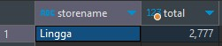

# About the project
This project are part of Data Science Virtual Internsip Experience Kalbe Nutritionals which covers Exploratory Data Analysis with SQL, Creating Dashboard with Tableau, Forecasting total product sold and CLustering cutomer behavior. Avalaible data are cutomer data, product data, store data and transaction data.

# Goals and Objective
  * Goal
    - Analyze transaction data.
    - Build dashboard.
    - Forecast quantity item sold for next 30 days.
    - Generate cutomer segmentation and recommendation.
  * Objective
    - Exploratory data analysis with DBeaver.
    - Create Dashboard with Tableau.
    - Build forecast model with ARIMA alogarithm.
    - Build clustering model.


# Getting Started
To run this project you will need Tableau Public account to build Dashboard, PostgreSQL and DBeaver to run queries and Jupyterlab to run modeling.
## Built with
- [![Python][Python.com]][Python-url]
- [![PSQL][PSQL.com]][PSQL-url]
- [![Dbeaver][Dbeaver.com]][Dbeaver-url]
- [![Tableau][Tableau.com]][Tableau-url]
- [![Anaconda][Anaconda.com]][Anaconda-url]
- [![Jupyter][Jupyter.com]][Jupyter-url]
- [![numpy][numpy.com]][numpy-url]
<!-- - [![pandas][pandas.com]][pandas-url] -->
- <a href="https://pandas.pydata.org/">
    
  </a>

<!-- - [![matplotlib][matplotlib.com]][matplotlib-url] -->
- <a href="https://matplotlib.org/stable/index.html">
    
  </a>
<!-- - [![seaborn][seaborn.com]][seaborn-url] -->
- <a href="https://seaborn.pydata.org/index.html">
    
  </a>
## Prerequisites
These are some library you need to run the project, i put the pip installation to make it easy for you.


* Pandas
  ```sh
  pip install pandas
  ```
* Matplotlib
  ```sh
  pip install matplotlib
  ```
* Seaborn
  ```sh
  pip install seaborn
  ```
* numpy
  ```sh
  pip install numpy
  ```
# Direction
This project divided in 4 part, EDA with DBeaver, Build Dashboard with Tableau, Forecasting in Jupyter, Clustering in Jupyter.
## EDA with SQL
In this process you need PostgreSQL and DBeaver installed in your system. After successfully connected to your local server you need to import all data set to database, notice that dataset use ';' separator.<br>


Information we need to query are :
- marital statu average age <br>
    
- gender average age<br>
    
- store name with most quantity sold<br>
    
- product with highest revene<br>
    

The complete query you can check in the code section, or <a href="https://github.com/jarni66/vix_ds_kalbe/blob/main/queries.sql">here</a>.

## Build Dashboard
This process are not covered in this repository, you can check the Final Submission slides here for more detailed information.

To able access Tableau Public you need to have an account, you can check here. After signed in you can choose create and then click web authoring. Import all data set one-by-one on Tableau, then you can create worksheet. 

In this dashboard you will need worksheet that cover :
- month-to-month quantity sold
- days-to-days revenue
- quantity sold by products
- revenue by store name


for complete dashboard check <a href="https://public.tableau.com/app/profile/nizar6696/viz/KalbeVIX/KalbeDashboard#1">here</a>.

## Forecasting
Data were having cleaning process to adjust some feature data type convert and imputate null value with KNNImputer.

For this process we use subset data from transaction dataset where data were grouped to days and qty were sum, yield 365 rows qty data which is quantity product sold of year 2022. Data then transform to log values and next data split to train/test data.


To use ARIMA model data must have in stationary condition. We check data stationary with ACF and PACF plot and ADF test. From ACF and PACF plot result there is horizontal scatter which means data is stationary. From ADF test result p-values near to zero which means data is stationary.


Modelling ARIMA model need parameter p,d,q which we can have with trial or with auto-fit ARIMA. In this process we do both method which auti-fit ARIMA and manual parameter tuning. With auto-fit ARIMA we got parameter 2,0,2 and with manual parameter tuning we have 4,3,2. We compare this 2 parameters forecast result in plot and some metrics such as MAE, MAPE, RMSE. From comparison we choose parameter 2,0,2 which have lowest metrics values.


With ARIMA model 2,0,2 we forecast quantity product sold of year 2022 data for next 30 days which mean for January 2023. Also we forecast for each product quantity for more detailed stock preparation.


Check detailed source code <a href="https://github.com/jarni66/vix_ds_kalbe/blob/main/Kalbe.ipynb">here</a>.

## Clustering
For clustering model we need prepare data which use feature count of transaction, sum of quantity, sum of totalamount (revenue), resulted 447 data for each unique customer. 


Data then check for outliers and transform with Standarization, which are essential for clustering model. Then we perform elbow method to find optimal n clusters, results n_cluster=3. Model then evaluated with plot for each clusters and silhouette score, resulting clusters were divide in good condition and having silhouette score 0.428.


Clusters reluts then analyze with RFM method which generates customers characteristic for each parameters such as recency, frequency and monetary. 


Customer cluster charcteristic :
- Cluster 0 (New Customer):
    - Mostly having higher recency
    - Have Lowest Frequency and Monetary
    * Strategies :
        - Provide support
        - Gift discount
        - Build Relationship
- Cluster 1 (Potential Loyalist):
    - Have medium recency
    - Have  Highest Frequency and Monetary
    * Strategies :
        - Offer loyalty program
        - Run contest
        - Make them feel special
- Cluster 2 (Loyal Customer):
    - Have Highest low recency
    - Have Medium Frequency and Monetary
    * Strategies :
        - Take feedback and surveys
        - Upsell product
        - Present bonus

Check detailed source code <a href="https://github.com/jarni66/vix_ds_kalbe/blob/main/Kalbe.ipynb">here</a>.


[numpy.com]: https://img.shields.io/badge/numpy-000000?style=for-the-badge&logo=numpy&logoColor=white
[numpy-url]: https://numpy.org/install/
[Anaconda.com]: https://img.shields.io/badge/anaconda-000000?style=for-the-badge&logo=anaconda&logoColor=white
[Anaconda-url]: https://www.anaconda.com/download
[Tableau.com]: https://img.shields.io/badge/tableau-000000?style=for-the-badge&logo=tableau&logoColor=white
[Tableau-url]: https://public.tableau.com/app/discover
[Dbeaver.com]: https://img.shields.io/badge/dbeaver-000000?style=for-the-badge&logo=dbeaver&logoColor=white
[Dbeaver-url]: https://dbeaver.io/download//
[PSQL.com]: https://img.shields.io/badge/postgresql-000000?style=for-the-badge&logo=postgresql&logoColor=white
[PSQL-url]: https://www.postgresql.org/download/
[Python.com]: https://img.shields.io/badge/python-000000?style=for-the-badge&logo=python&logoColor=white
[Python-url]: https://www.python.org/
[VScode.com]: https://img.shields.io/badge/vscode-000000?style=for-the-badge&logo=visual-studio-code&logoColor=white
[VScode-url]: https://code.visualstudio.com/
[Jupyter.com]: https://img.shields.io/badge/jupyter-000000?style=for-the-badge&logo=jupyter&logoColor=white
[Jupyter-url]: https://jupyter.org/
[Selenium.com]: https://img.shields.io/badge/selenium-000000?style=for-the-badge&logo=selenium&logoColor=white
[Selenium-url]: https://www.selenium.dev/
[BS.com]: https://img.shields.io/badge/Beautifulsoup-000000?style=for-the-badge&logo=&logoColor=white
[BS-url]: https://www.crummy.com/software/BeautifulSoup/bs4/doc/
[pandas.com]: https://pandas.pydata.org/
[pandas-url]: https://img.shields.io/badge/pandas-000000?style=for-the-badge&logo=&logoColor=white
[matplotlib.com]: https://matplotlib.org/stable/index.html
[matplotlib-url]: https://img.shields.io/badge/matplotlib-000000?style=for-the-badge&logo=matplotlib&logoColor=white
[seaborn.com]: https://seaborn.pydata.org/index.html
[seaborn-url]: https://img.shields.io/badge/seaborn-000000?style=for-the-badge&logo=seaborn&logoColor=white